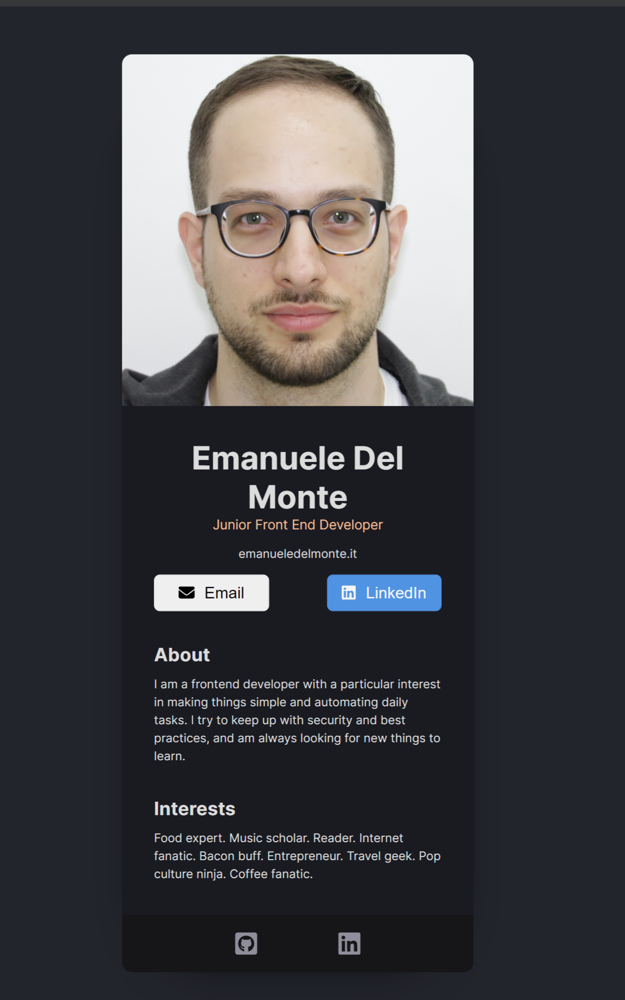
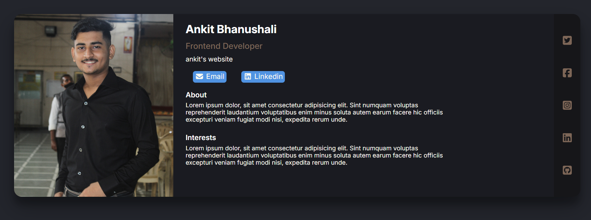

# 💼 Digital Business Card — React Solo Project

This project is part of the [Scrimba React Course](https://scrimba.com/learn-react-c0e) Solo Project Challenge.  
The goal was to create a **personal digital business card** using React — complete with contact links, social media icons, and responsive design.

---

## 🎯 Challenge Overview

**Challenge Given (from Scrimba):**
Create a React component that represents a personal business card containing:
- Profile image
- Name and job title
- Website link
- Email and LinkedIn buttons
- “About” and “Interests” sections
- Social media icons

**My Completed Project:**
I recreated the challenge using **React components**, **Font Awesome icons**, and **responsive CSS** with variables for colors, typography, and layout.

---

## 🖼️ Project Preview

### 🎨 Challenge Design (from Scrimba)
>


### 💻 My Completed Version
> 


---

## ⚙️ Technologies Used

- **React.js (Vite)**
- **CSS3 with variables & media queries**
- **Font Awesome (for icons)**
- **Responsive design principles**
- **Flexbox layout**

---

## 🧠 What I Learned

- How to structure React components effectively  
- How to use **Font Awesome** icons in React  
- Responsive layouts with **flexbox and media queries**  
- Organizing styles using **CSS variables** for scalability  
- Implementing a mobile-friendly design with smooth resizing  

---

## 🚀 Getting Started

### 1. Clone this repository
```bash
git clone https://github.com/ankit-revosolve/Business_Card.git
cd digital-business-card
```
### 2. Install dependencies
```bash
npm install
```

### 3. Run the project
```bash
npm run dev
```
Your app will be live at http://localhost:5173/ (if using Vite).